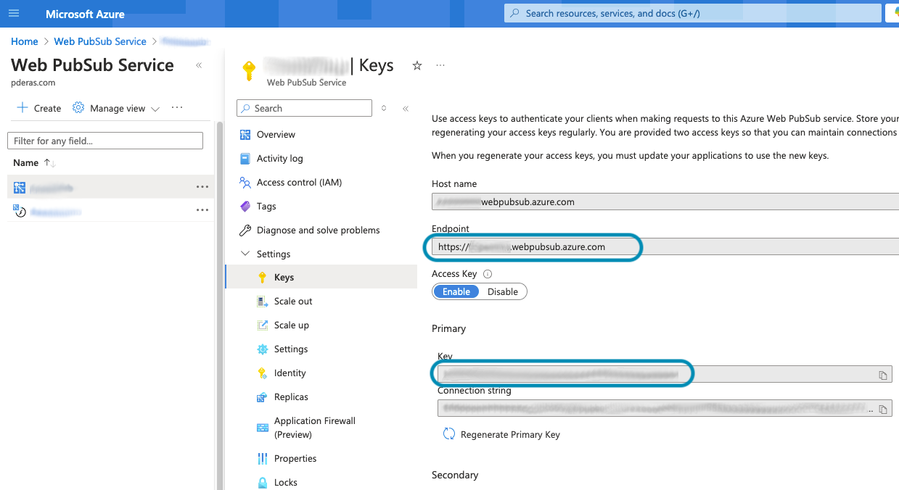

# An Azure Web PubSub Package
This package provides the backend features required to broadcast with Azure's PubSub Service

# Installation
Add repository to `composer.json`
```json
    "repositories": [
        {
            "type": "vcs",
            "url": "git@github.com:PDERAS/azure-pubsub.git"
        },
    ]
```

Install via composer 
```
composer require pderas/azure-pubsub
```


# Configuration
```php
// config/broadcasting.php
return [
    'default' => env('BROADCAST_DRIVER', 'azure'),

    'connections' => [
        'azure' => [
            'driver'    => 'azure-broadcaster',
            'key'       => env('PUBSUB_KEY'),
            'endpoint'  => env('PUBSUB_ENDPOINT'),
            'expiry'    => env('PUBSUB_EXPIRY', 3600),
        ],
];
```

The keys and endpoint can by found in your Azure PubSub portal under the `Keys` setting


# Client Configuration
A separate package can be found here for front-end usage: https://github.com/PDERAS/azure-pubsub-client