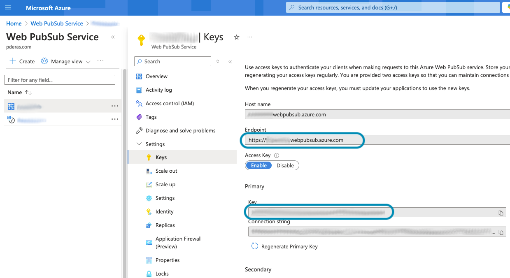

# An Azure Web PubSub Package
This package provides the backend features required to broadcast with Azure's PubSub Service

# Installation
Add repository to `composer.json`
```json
    "repositories": [
        {
            "type": "vcs",
            "url": "git@github.com:PDERAS/azure-pubsub.git"
        },
    ]
```

Install via composer 
```
composer require pderas/azure-pubsub
```


# Configuration
In `.env`
```ini
# Required: Your Azure Web PubSub endpoint
PUBSUB_ENDPOINT="https://your-service-name.webpubsub.azure.com"

# Choose your auth method: 'managed' (for Managed Identity) or 'key'
PUBSUB_AUTH_METHOD="managed"

# Required only if using key-based auth
PUBSUB_KEY="your-pubsub-key"

# Set the broadcast driver to use Azure
BROADCAST_DRIVER=azure
```

The keys and endpoint can by found in your Azure PubSub portal under the `Keys` setting


## Configure broadcasting
Update your `config/broadcasting.php` to include the Azure connection:

```php
return [
    'default' => env('BROADCAST_DRIVER', 'azure'),

    'connections' => [
        'azure' => [
            'driver'        => 'azure-broadcaster',
            'key'           => env('PUBSUB_KEY'),
            'endpoint'      => env('PUBSUB_ENDPOINT'),
            'expiry'        => env('PUBSUB_EXPIRY', 3600),
            'auth_method'   => env('PUBSUB_AUTH_METHOD', 'managed') // or 'key'
        ],
    ],
];
```

# Client Configuration
A separate package can be found here for front-end usage: https://github.com/PDERAS/azure-pubsub-client